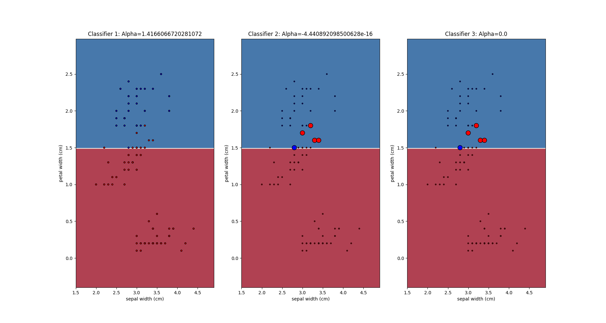

# ES654-2020 Assignment 2

*Kavita Vaishnaw* - *17110073*

------

> Write the answers for the subjective questions here\
\
\

Accuracy of AdaBoostClassifier = 0.95\
Accuracy for Decision Stump = 0.945\

Note: Although the weights are updating, the split is almost the same becasue it is not  bringing about much change in probability distribution. Thus, accuracies of both models is almost equal.
