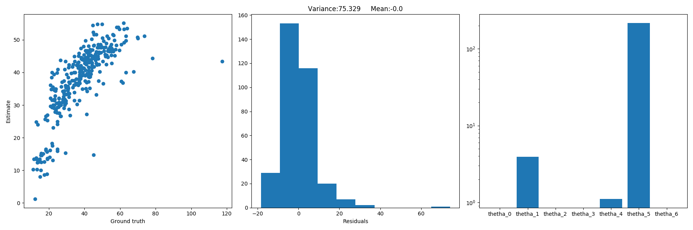

# ES654-2020 Assignment 2

*Kavita Vaishnaw* - *17110073*

------

> Write the answers for the subjective questions here

N=50, P=4, time=0.0030214786529541016\
N=100, P=2, time=0.0023741722106933594\
N=50, P=2, time=0.0022287368774414062

Theoritical time complexity = O(D^2N) + O(D^3)

Empirical evidence:
When N increases by factor of 2, time increases by factor of 1.081\
When P increases by factor of 2, time increases by factor of 1.374

Fold 0: Train MAE=6.356648544888426     Test MAE=5.409135402003294

Fold 1: Train MAE=6.225038778000448     Test MAE=5.84281796577379

Fold 2: Train MAE=5.986175277403179     Test MAE=6.716350861975073

Fold 3: Train MAE=5.943281326736378     Test MAE=6.87922464936378

Fold 4: Train MAE=6.159659209846373     Test MAE=6.114009124102529

